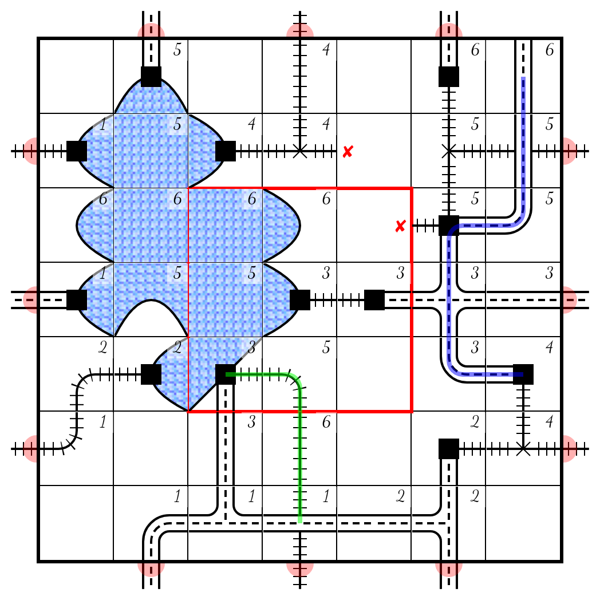

# Railroad Ink

This is a web-based version of the [Railroad Ink Board Game](https://boardgamegeek.com/boardgame/245654/railroad-ink-deep-blue-edition).
Implemented features:

  - base game, lakes expansion
  - playable and installable on mobile devices
  - online multiplayer
  - score visualization
  - works offline
  - saving the game board as an image

Please report any bugs found to the [issue tracker](https://github.com/ondras/rri/issues).

## How to play

Familiarize yourself with [game rules](https://www.horrible-games.com/wp-content/uploads/2018/07/RRI_BLU_Rulebook_ENG_v05_light.pdf) first. Rules for the [forests expansion](#forests-expansion) follow.

Playing the game is very straightforward; you pick pieces by clicking/touching the dice pool and you place them by clicking/touching the game board afterwards. To **rotate** a tile, place it and then touch it again. To **remove** a tile, double-click/double-touch it.

You shall end the turn after placing all dice (and optionally one dice from the bonus pool) by clicking the corresponding button.

## Networking

**The game server has been recently reworked to support the newest Deno version. Please [open an issue](https://github.com/ondras/rri/issues) if the multiplayer component looks buggy.**

The game supports online multiplayer setup, provided that all participants have a working internet connection.
Please note that a central server is used; if it comes down, the multiplayer component will not work.

In order to play online, the first player must **create** the game (and name it appropriately). Other players can then **join** the game (they need to use the exact game name) and wait for the host to start.

During the online match, you may freely close and re-open your app. The multiplayer menu will then have a **Continue** option enabled which can be used to re-enter a game in progress.

## *Forests* expansion

*"The old forests are beautiful. We are not allowed to cut them down, but passengers love the view while passing them."*

Rules (created by [Niklas Thomas](https://boardgamegeek.com/thread/2392579/railroad-ink-green-edition-fanmade)):

- The Game only lasts for 6 regular rounds (+1 pre-round)
- During the first round both players draw 4 forests spaces somewhere on their board
- Forest spaces may not be overbuild, Routes may connect to forest spaces, but they counts as Errors at the end of the game.
- Edges of forest spaces never counts as errors
- Each Route adjacent (not diagonal) or connected to at least one forst space is worth 1 point at the end of the game.

